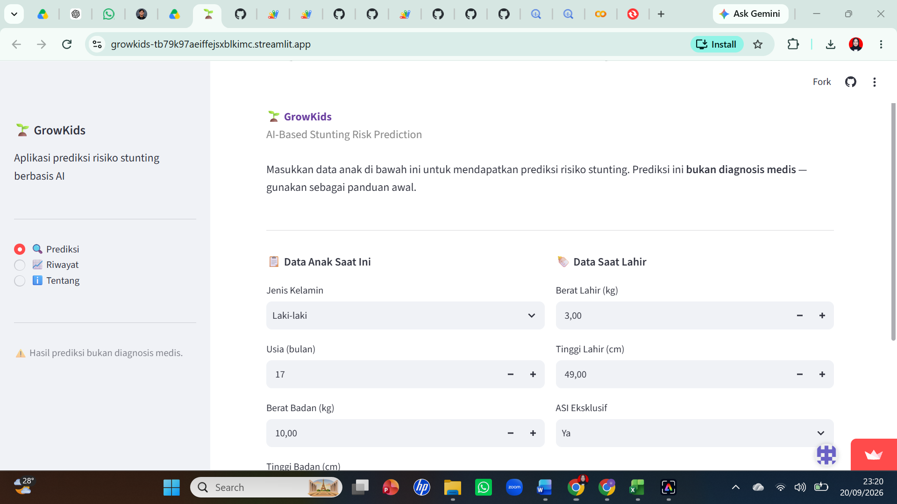

# Child Growth & Stunting Risk Analysis



## 📌 Overview

Project ini diangkat dari permasalahan **keterbatasan akses layanan kesehatan dan pemantauan pertumbuhan anak di wilayah pelosok desa**. Project dikembangkan sebagai prototype dashboard untuk membantu **screening awal risiko stunting** berdasarkan data pertumbuhan anak. Pada tahap awal, project menggunakan **K-Nearest Neighbors (KNN)** untuk memprediksi status stunting berdasarkan karakteristik anak. Menurut WHO, stunting pada anak di bawah lima tahun ditandai dengan tinggi/panjang badan menurut umur yang berada di bawah **-2 SD** dari median WHO Child Growth Standards.

> Project ini dibuat untuk tujuan pembelajaran dan screening awal berbasis data, bukan sebagai alat diagnosis medis.

## 💭 Ide Awal

Project ini bermula dari keinginan membuat **web yang dapat membantu orang tua melakukan pengecekan awal risiko stunting**, khususnya di wilayah dengan akses layanan kesehatan yang terbatas. Untuk menghasilkan prediksi secara otomatis, digunakan dataset percobaan yang berisi karakteristik anak dan status stunting. Model **KNN** kemudian dilatih dan diintegrasikan ke dalam web sebagai prototype.

## 🔎 Alur Analisis

1. **Data Understanding**
   Memahami struktur dan karakteristik dataset yang mencakup jenis kelamin, umur, berat badan, tinggi badan, berat lahir, tinggi lahir, riwayat ASI eksklusif, dan status stunting.

2. **Preprocessing**
   Melakukan pemeriksaan missing value dan tipe data, encoding, pemilihan fitur, standardisasi, serta train-test split.

3. **Exploratory Data Analysis**
   Menganalisis distribusi status stunting serta karakteristik umur, jenis kelamin, tinggi dan berat badan.

4. **Initial Modeling — KNN**
   Menggunakan KNN dengan `K = 5` untuk mengklasifikasikan status stunting berdasarkan karakteristik anak.

## 🔁 Evaluasi & Pengembangan

Setelah dilakukan evaluasi terhadap pendekatan awal, ditemukan bahwa **KNN kurang sesuai sebagai dasar screening stunting individu**.

* KNN menentukan prediksi berdasarkan kemiripan dengan data anak lain dalam dataset.
* Tinggi badan belum digunakan sebagai fitur utama, padahal merupakan indikator penting dalam penilaian **height-for-age**.
* Nilai `predict_proba()` tidak dapat langsung diinterpretasikan sebagai probabilitas klinis stunting.

Berdasarkan evaluasi tersebut, pendekatan screening individu diarahkan menggunakan **Height-for-Age Z-score (HAZ) berdasarkan standar pertumbuhan WHO**. Namun, ide penggunaan **machine learning tetap dapat dikembangkan** untuk tujuan analisis risiko pada tingkat populasi. Dengan demikian, perubahan yang dilakukan bukan pada tujuan project, tetapi pada **kesesuaian metode dengan konteks penggunaannya**.

## 🖥️ Revised Dashboard Concept

Pengembangan selanjutnya diarahkan menjadi dashboard berbasis HAZ dengan alur:

```text
Data Anak
   ↓
Umur + Jenis Kelamin + Tinggi/Panjang Badan
   ↓
WHO Growth Standards
   ↓
HAZ
   ↓
Screening Result
   ↓
Interpretation
```

Dashboard ditujukan untuk membantu pengguna memahami hasil pengukuran tanpa harus melakukan perhitungan atau membaca tabel pertumbuhan secara manual.

## 🚀 Future Development

* Implementasi perhitungan HAZ berdasarkan reference WHO secara lengkap.
* Pengembangan dashboard interaktif menggunakan Streamlit.
* Penambahan fitur **growth monitoring** berdasarkan riwayat pengukuran.
* Pengembangan model machine learning untuk analisis risiko pada tingkat populasi setelah pendekatan HAZ tervalidasi.
* Integrasi **Large Language Model (LLM)** untuk membantu menjelaskan hasil screening dalam bahasa yang lebih sederhana.


